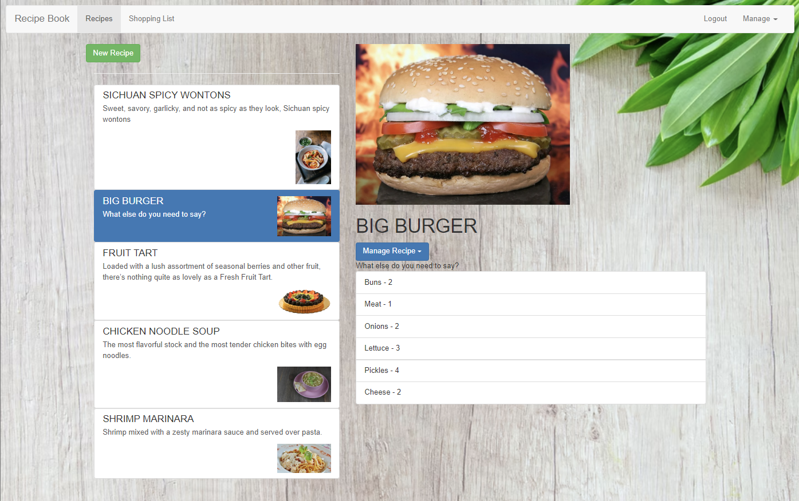
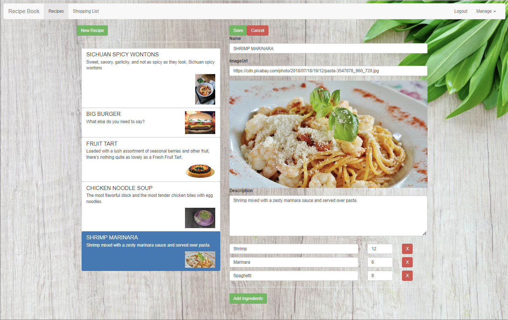

# Recipe-Book-and-Shopping-List
<ul>
    <li>Recipe Book and Shopping List Angular app hosted on Firebase generated with <a href="https://github.com/angular/angular-cli" rel="noreferrer noopener" target="_blank">Angular CLI</a> version 14.0.3.</li> 
    <li>Login/Signup with authentication using the <a href="https://firebase.google.com/docs/reference/rest/auth#section-create-email-password" rel="noreferrer noopener" target="_blank">Firebase Auth REST API</a>.</li>
    <li>Manage your recipes and view them in detail. Manage your shopping list and push ingredients from a recipe directly to the shopping list.</li>
    <li>Recipes and shopping list are saved and fetched using the <a href="https://firebase.google.com/docs/reference/rest/database" rel="noreferrer noopener" target="_blank">Firebase Database REST API</a>.</li>
    <li><a href="https://ng-course-recipe-book-5433b.web.app/auth" rel="noreferrer noopener" target="_blank">Webapp</a> securely hosted using <a href="https://firebase.google.com/docs/hosting" rel="noreferrer noopener" target="_blank">Firebase Hosting</a>.</li>
</ul>

<h3>Login/Sign up Page</h3>

<h3>Recipes Page</h3>

<h3>Recipes Edit Page</h3>

<h3>Manage Recipes</h3>

<h3>Shopping-List Page</h3>

<h3>Save and Fetch: Saving and fetching from Firebase database.</h3>

<h3>Development Server</h3>
<ul>
    <li>Run <code>ng serve</code> for a dev server. Navigate to <code>http://localhost:4200/</code>. The app will automatically reload if you change any of the source files.</li>
</ul>

<h3>Build</h3>
<ul>
    <li>Run <code>ng build</code> to build the project. The build artifacts will be stored in the dist/ directory.</li>
</ul>

<h3>Process</h3>
<ol>
    <li>Created components for Recipes, Shopping Lists and Header.</li>
    <li>Created services for Recipe and Shopping Lists for cross-component communication.</li>
    <li>Added routing functionality.</li>
    <li>Added template driven forms and reactive forms to Recipes and Shopping List.</li>
    <li>Connected Angular App to Firebase database using <a href="https://firebase.google.com/docs/reference/rest/database">Firebase Database REST API</a>.</li>
    <li>Added Login/Signup functionality using Authentication with the <a href="https://firebase.google.com/docs/reference/rest/auth#section-create-email-password">Firebase Auth REST API</a>.</li>
    <li>Optimized app into feature modules, shared modules and core modules and incoporated lazy loading and preloading.</li>
    <li>Deployed using <a href="https://firebase.google.com/docs/hosting">Firebase Hosting</a>.</li>
</ol>

